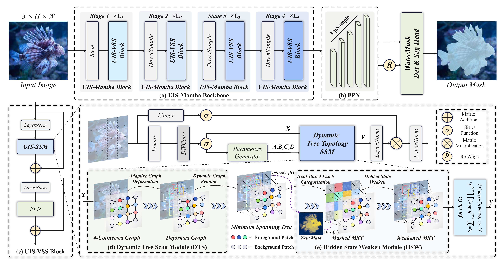

# UIS-Mamba
[ACM MM2025]UIS-Mamba: Exploring Mamba for Underwater Instance Segmentation via Dynamic Tree Scan and Hidden State Weaken

This repository is the official implementation of "UIS-Mamba: Exploring Mamba for Underwater Instance Segmentation via Dynamic Tree Scan and Hidden State Weaken" accepted by the Main Technical Track of the 33rd ACM International Conference on Multimedia (ACM MM2025).

